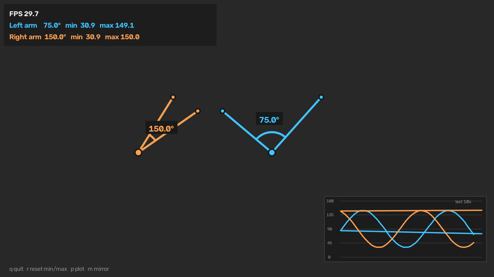

# Elbow angle tracker

Live webcam tracking of the elbow angle: MediaPipe PoseLandmarker finds
shoulder, elbow and wrist, and the angle enclosed between upper arm and forearm
is measured and drawn for both arms in real time.



## Setup

Already done in this repo (`.venv/` + `models/`). From scratch:

```powershell
python -m venv .venv
.\.venv\Scripts\python.exe -m pip install -r requirements.txt
```

The pose model (~9 MB) is downloaded automatically on first run into `models/`.

## Run

```powershell
.\.venv\Scripts\python.exe elbow_tracker.py
```

| Key | Action |
| --- | --- |
| `q` / `ESC` | quit |
| `r` | reset the min/max range-of-motion counters |
| `p` | toggle the angle history plot |
| `m` | toggle mirrored view |

## What you see

- **Skeleton overlay** — shoulder, elbow and wrist of both arms, blue = left
  arm, orange = right arm (anatomically, not screen side).
- **Angle label + arc** at each elbow. 180 deg = arm fully extended,
  0 deg = fully folded.
- **HUD** with FPS and, per arm, the current angle plus the smallest and
  largest angle reached since the last reset.
- **Plot** in the lower right: the last 10 seconds of both angles.

The angle is computed from MediaPipe's *world* landmarks, i.e. in metric 3D
space, so it stays correct when the arm points towards or away from the camera.
The arc is the projection onto the image plane and is only an illustration --
the number is the true 3D angle.

Detection runs on the unmirrored frame so that MediaPipe's left/right labels
stay anatomically correct; only the displayed image is mirrored.

## Options

```
--camera N            camera index (default 0)
--width / --height    requested capture resolution (default 1280x720)
--model PATH          pose_landmarker_{lite,full,heavy}.task, downloaded if missing
--smoothing A         angle EMA factor, 1.0 = off (default 0.45)
--min-visibility V    landmark visibility needed to measure an arm (default 0.5)
--plot-seconds S      time window of the plot (default 10)
--no-mirror           show the raw, unmirrored camera image
--verbose             show MediaPipe's native startup logs instead of hiding them
```

Stop it with `q` or `ESC` while the video window has focus, or with `Ctrl+C` in
the terminal -- both shut down cleanly. Note that `q` is read by the video
window, so it does nothing while the terminal is the focused window.

By default MediaPipe's C++ startup chatter (`Created TensorFlow Lite XNNPACK
delegate`, `Feedback manager requires ...`, `Using NORM_RECT without
IMAGE_DIMENSIONS`) is hidden. Those lines are harmless, but they look like
errors. `--verbose` shows them again; the muting only covers graph setup and
the frames before the first pose is found, so genuine errors still surface.

If it feels slow, use the smaller model:

```powershell
.\.venv\Scripts\python.exe elbow_tracker.py --model models\pose_landmarker_lite.task
```

Raise `--smoothing` towards 1.0 for a more responsive but jumpier angle, lower
it for a calmer one.
